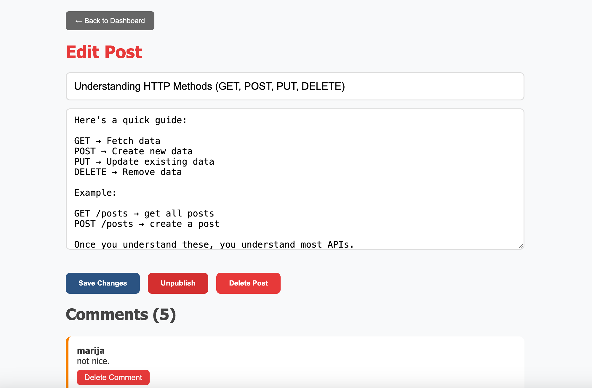
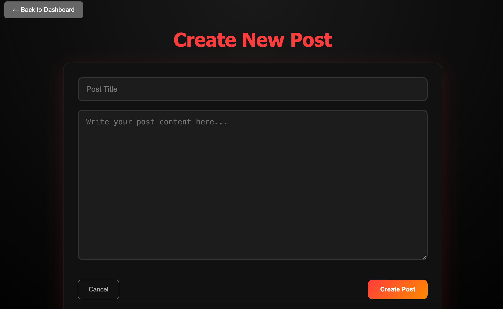

# blog-api 

App runs on:
https://marijaavramovic.github.io/blog-public/

Frontend for Admin runs on:
https://blog-admin-marijaa.netlify.app/
 

Backend API is running on:
https://blog-api-wwtw.onrender.com/

Separate GitHub repos for each of the three apps:

 Public: https://github.com/MarijaAvramovic/blog-public  

 Admin: https://github.com/MarijaAvramovic/blog-admin  

 API: https://github.com/MarijaAvramovic/blog-api (current)

A RESTful API for a blog platform built with Express and Prisma.
It handles users, posts, and comments with authentication using JWT.

🚀 Features
🔐 Authentication with JWT
👤 Users (admin & basic roles)
📝 Create, edit, delete posts
📢 Publish / unpublish posts
💬 Add and manage comments
📅 Timestamps for posts and comments
🔒 Protected routes (admin only)
🛠️ Tech Stack
Node.js
Express
Prisma ORM
PostgreSQL (or any Prisma-supported DB)
jsonwebtoken (JWT)
 
🔐 Authentication
Login returns a JWT
Client stores token (e.g. localStorage)
Send token in requests:
Authorization: Bearer <token>
Protected routes require a valid token
 
 

Used Postman to test endpoints:

Send GET, POST, PUT, DELETE requests
Add JWT in headers for protected routes
 
💡 Notes
Unpublished posts are stored but hidden from public users
Only admins can create/edit/delete posts
Comments require a username

Create new account or use username: marijaa psw:123456 as basic/admin role.